# EXPERIMENT--01-ALP-FOR-8086
Name : M.SOWMYA
Roll no :212221230107
Date of experiment :10-09-2022

## Aim:
       To Write and execute ALP on fundamental arithmetic and logical operations
## Components required: 
         8086  emulator 
## Theory 
Running The Emulator (emu8086) Intro 8086 Microprocessor Emulator, also known as EMU8086, is an emulator of the program 8086 microprocessor. It is developed with a built-in 8086 assembler. This application is able to run programs on both PC desktops and laptops. This tool is primarily designed to copy or emulate hardware. These include the memory of a program, CPU, RAM, input and output devices, and even the display screen. There are instructions to follow when using this emulator. It can be executed into one of the two ways: backward or forward. There are also examples of assembly source code included. With this, it allows the programming of assembly language, reverse engineering, hardware architecture, and creating miniature operating system (OS). The user interface of 8086 Microprocessor Emulator is simple and easy to manage. There are five major buttons with icons and titles included. These are “Load”, “Reload”, “Step Back”, “Single Step”, and “Run”. Above those buttons is the menu that includes “File”, “View”, “Virtual Devices”, “Virtual Drive”, and “Help”. Below the buttons is a series of choices that are usually in numbers and codes. At the leftmost part is an area called “Registers” with an indication of either “H” or “L”. The other side is divided into two, which enables users to manually reset, debug, flag, etc. What is 8086 emulator emu8086 is an emulator of Intel 8086 (AMD compatible) microprocessor with integrated 8086 assembler and tutorials for beginners. Emulator runs programs like the real microprocessor in step-by-step mode. it shows registers, memory, stack, variables and flags.

 ## Running the Emulator :
1.	Download and install emu8086 (www.emu8086.com) It is usually installed in C:\EMU8086 subfolder in the “Windows” directory.
2.	Run  emu8086 icon (on the desktop or in the c:\EMU8086 folder of window) It has green color.
3.  Write the code for the appropriate program for ADDITION,SUBTRACTION, MULTIPLICATION,  DIVISION operations.
4.	CCompile the program and check for the errors.
5.	Run (once there is no syntax error).
6.	Click OK to see/view the output of your program on the Emulator screen. 
7.	After running the program, another menu screen will be displayed, where you have the option to “View” symbol table,
8.	

9.	Click on emulate to start emulation 
    
10.	If no errors are found click on run the program and check the status of various flags in the flags tab as shown below 

 
## Programs for arithmetic  operations:

## Addition  of 8 bit ALP :
     # ADDITION:
          org 100h
          MOV AH,10;
          MOV BH,02;
          ADD AH,BH;
          MOV CX,AX;
          HLT;
   ## Output: 
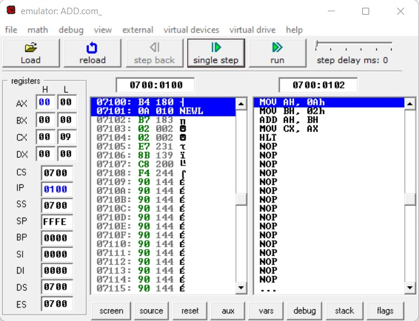
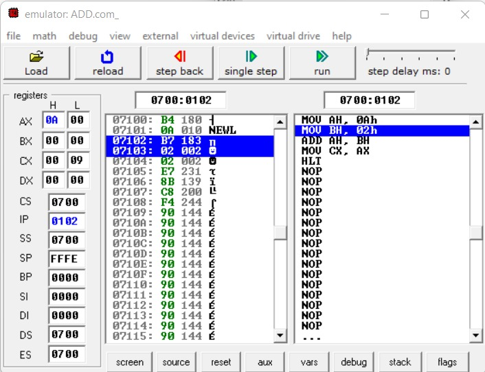
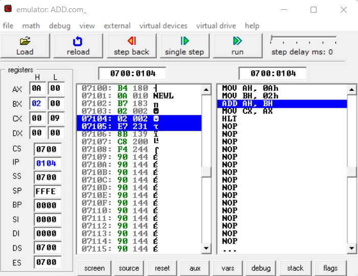
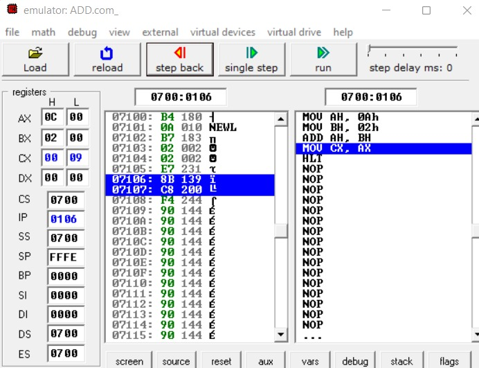
 
## Subtraction   of 8 bit numbers  ALP :
    # SUBTRACTION:
          org 100h
          MOV AH,10;
          MOV BH,02;
          SUB AH,BH;
          MOV CX,AX;
          HLT;
## Output:
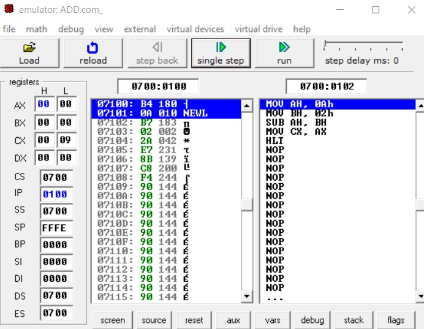
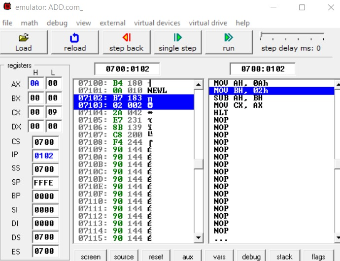
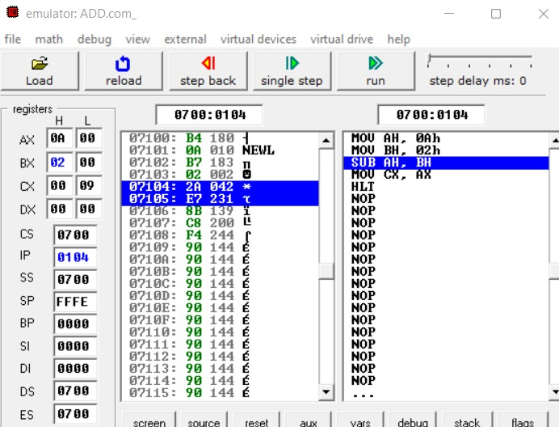
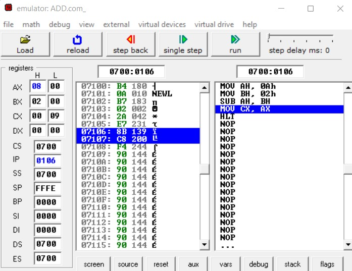
   

## Multiplication ALP:
     # MULTIPLICATION:
          org 100h
          MOV AL,05;
          MOV BL,03;
          MUL BL;
          MOV AL,CL;
          MOV AL, 00;
          HLT;

 ## Output:
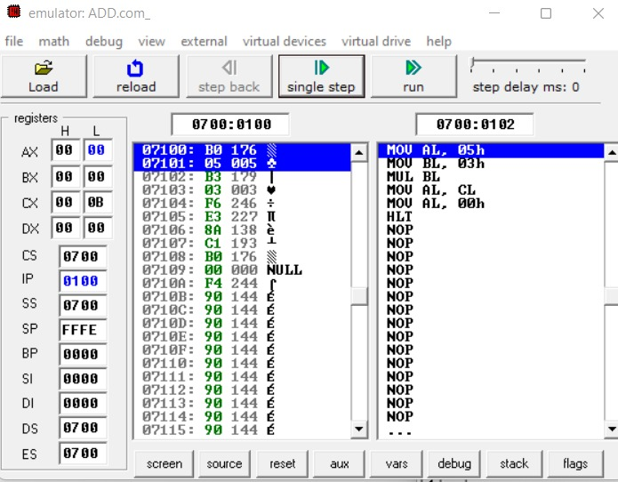 
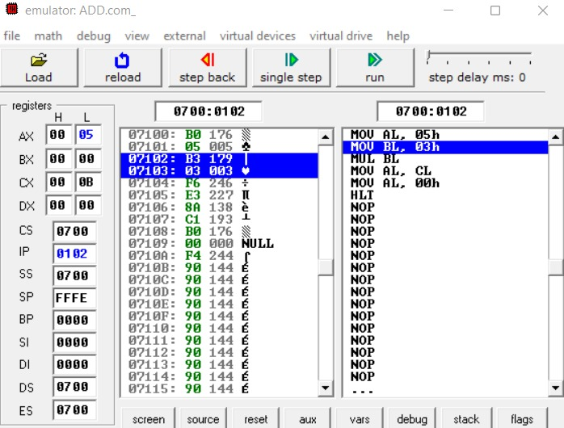
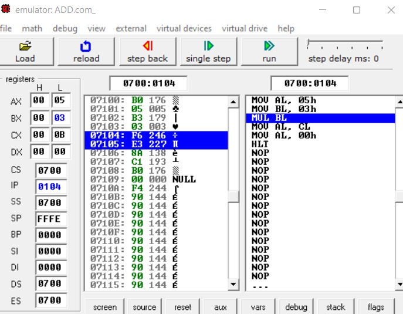
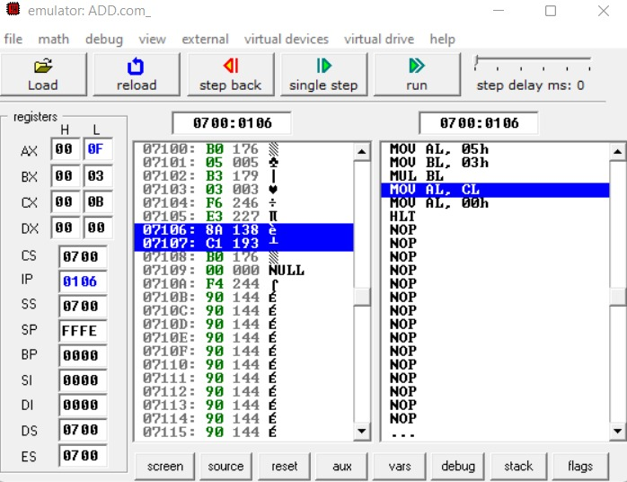
## Division ALP:
     # DIVISION:
          org 100h
          MOV AL,04;
          MOV BL,02;
          DIV BL;
          MOV AL,CL;
          MOV AL, 00;
          HLT;
         
## Output :
 
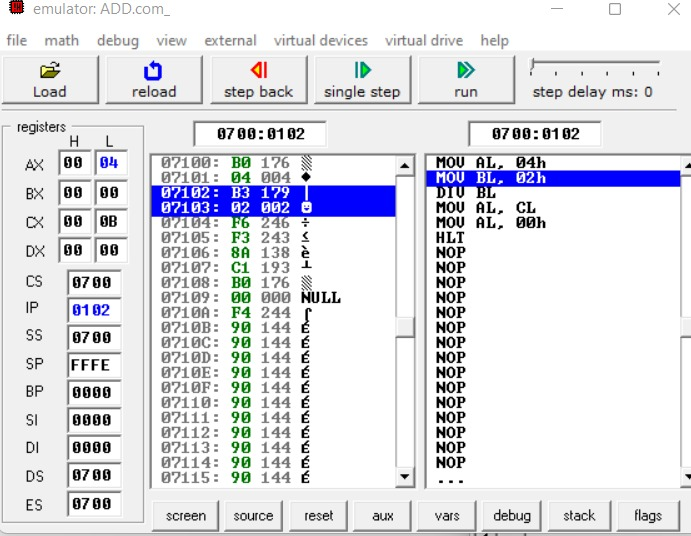

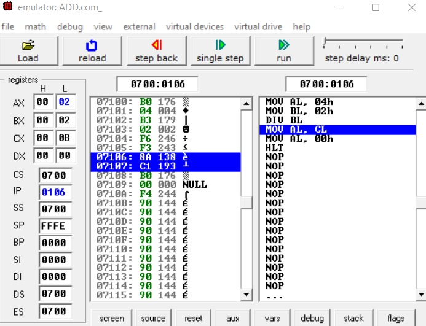

## Result :
To Write and execute ALP on fundamental arithmetic and logical operations was done successfully using 8086 software.
 

